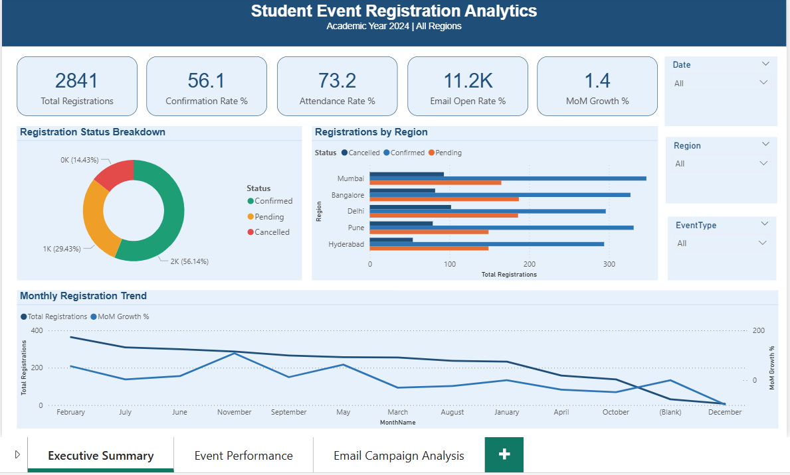
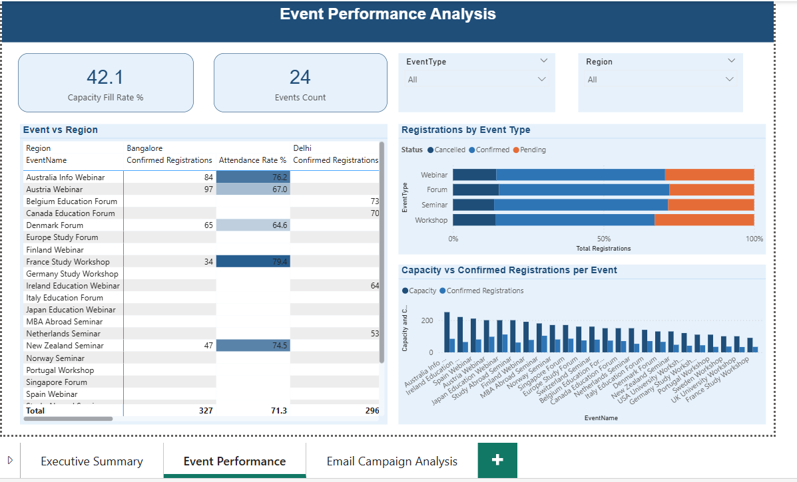
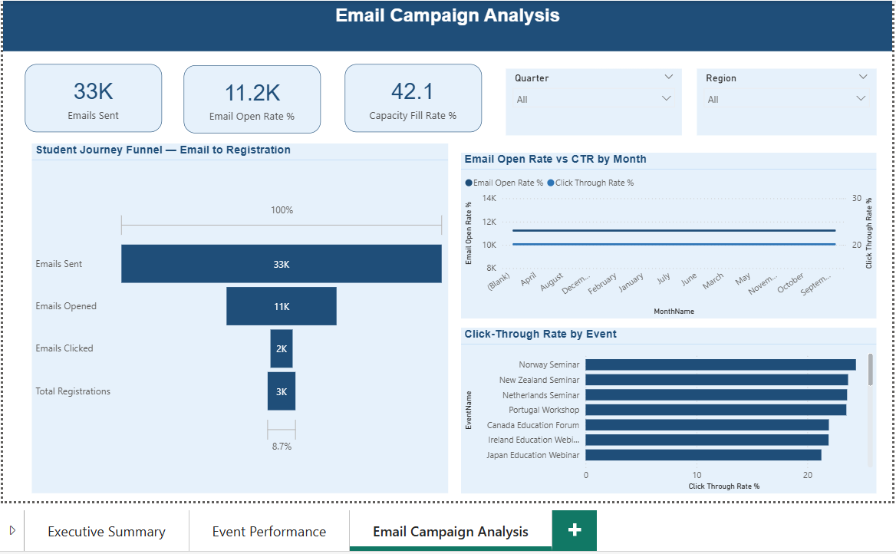

# Student Event Registration Analytics Dashboard ### Power BI | DAX | Star Schema | Education Domain --- ## Project Overview An end-to-end Power BI dashboard built to track student event registration performance across 5 Indian cities for an education consultancy. The dashboard covers registration trends, event capacity analysis, and email campaign effectiveness. --- ## Dashboard Pages | Page | Description | |------|-------------| | Executive Summary | KPI cards, regional breakdown, monthly trend | | Event Performance | Capacity vs confirmed, event type analysis | | Email Campaign | Funnel analysis, open rate, CTR by event | --- ## Key Metrics Tracked - Total Registrations: 2,841 across 24 events - Confirmation Rate, Attendance Rate, Cancellation Rate - Month-over-Month Growth % - Email Open Rate and Click-Through Rate - Regional Share % and Capacity Fill Rate % ---  ## Tools & Technologies - **Power BI Desktop** — Dashboard & visualisations - **DAX** — 15+ custom measures - **Power Query (M)** — Data cleaning & transformation - **Star Schema** — Data modelling (Fact + 3 Dimensions) - **Excel** — Source data (synthetic dataset) --- ## Data Model Star schema with 1 fact table and 3 dimension tables: - Fact_Registrations (2,841 rows) - Dim_Events (24 rows) - Dim_EmailCampaigns (24 rows) - Dim_Date (366 rows — custom M code) --- ## Screenshots    --- ## DAX Measures All DAX measures are documented in [dax/all_measures.md](dax/all_measures.md) --- ## Dataset Synthetic dataset generated using Python simulating real-world education consultancy registration data. Modelled after CRM and event registration workflows. --- ## Author ** Mansi Dhuri ** - Data Analyst
